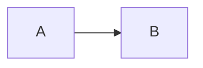
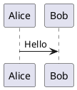

# 刷题助手

一个基于 **Vue 3 + Tauri** 的刷题应用，可作为桌面应用运行，也可通过 Docker 部署为纯 Web 应用。

## ✨ 功能特性

- 顺序练习、考试、背题、错题和专项练习
- 多错题本管理、导入导出、备份恢复
- 单选、多选、判断、填空、简答、程序分析、编程和复合题
- 安全 Markdown、代码高亮、Mermaid 和 PlantUML 图表
- 图片题、乱序练习、答题卡、暗黑模式
- Tauri 本地文件持久化；Web localStorage 持久化

## 🛠 技术栈

| 层面 | 技术 |
|------|------|
| 前端 | Vue 3 + TypeScript + Pinia |
| 构建 | Vite 7 |
| Markdown | marked + marked-highlight + highlight.js + DOMPurify |
| 图表 | Mermaid；可配置 PlantUML Server |
| 桌面 | Tauri 2 |
| Web 部署 | Docker + Nginx |

## 📁 主要目录

```text
src/
  components/              Vue 组件；MarkdownContent 是统一富文本入口
  composables/             答题、主题、Toast 等组合逻辑
  stores/                  quizStore 错题本数据层
  utils/                   Markdown、图表配置、题库 schema
  types.ts                 应用类型
public/
  subjects/                题库 JSON 与自动生成的 banks.json
  images/                  题目图片
  config/                  运行时配置、schema 文档和示例
scripts/
  generate-banks.mjs       生成题库清单
  convert-docx.mjs         DOCX 转题库工具
src-tauri/                 Tauri 工程
```

详细诊断和架构说明见 `ARCHITECTURE.md`。

## 🚀 快速开始

环境要求：Node.js `^20.19.0` 或 `>=22.12.0`。

```bash
npm install
npm run dev
```

常用检查和构建：

```bash
npm run prebuild
npm run type-check
npm run lint
npm run build
npm run preview
```

`npm run dev` 和 `npm run build` 会通过 npm 生命周期自动生成题库清单；Dockerfile 也会在构建前显式运行 `prebuild`。

## 📖 题库格式

题库放在 `public/subjects/`，根节点为题目数组。新题库推荐使用统一结构：

```json
{
  "id": "q-001",
  "number": 1,
  "type": "single",
  "content": "HTTP 的默认端口是什么？",
  "format": "text",
  "options": { "A": "21", "B": "80" },
  "answer": "B",
  "explanation": "HTTP 默认使用 80 端口。",
  "wrongDescription": "容易与 HTTPS 的 443 端口混淆。"
}
```

稳定题型标识：`single`、`multiple`、`true-false`、`fill`、`short-answer`、`program-analysis`、`code`、`compound`。旧中文题型和旧 `question` 字段仍兼容，但新题库应使用以上格式。

完整说明和示例：

- `public/config/question-schema.md`
- `public/config/examples/question-bank.example.json`

DOCX 转换配置示例：`public/config/examples/docx-convert.example.json`。转换结果会写入 `public/subjects/`。

## LLM 题库转换配置

设置页中的“AI 模型配置”和“文档转换”使用预装流水线完成“文档提取 → 模型转换 → Schema 校验 → 失败自动修复”。当前支持批量导入 DOCX、PDF、XLSX/XLSM、TXT、Markdown、JSON 和 CSV；PDF 文本层不足时会按页执行 OCR。Excel 当前只提取普通单元格文本，暂不处理复杂合并单元格和公式计算。

配套文件包括：

- `config/llm-config.json`：开发版实际读写的 AI 运行参数；
- `public/config/llm/framework.json`：转换与修复流水线；
- `public/config/llm/prompts/`：随应用发布的转换和修复 Prompt；
- `public/config/schemas/question-bank.schema.json`：模型输出的严格 JSON Schema；
- `public/config/examples/llm-user-config.example.json`：可复制的配置示例。

配置保存位置按运行环境区分：

- Tauri 桌面端：系统应用配置目录下的 `llm-config.txt`；首次读取时自动创建，可直接用记事本等文本编辑器读写，内容仍使用 JSON 格式；
- `npm run dev`：仓库根目录 `config/llm-config.json`；
- Web 生产版：浏览器 `localStorage` 降级存储，不能直接改写部署服务器文件。

外部编辑保存后，在设置页点击“重新读取”即可应用。

Temperature、最大输出 Token、请求超时和 OCR 参数都通过 JSON config 修改。API Key 不写入配置文件，只保存在当前 `sessionStorage` 会话中。扫描 PDF 首次 OCR 通常需要联网下载 `chi_sim+eng` 语言数据；当前没有把离线 traineddata 打进安装包。

可运行 `npm run config:check` 检查配置引用、Prompt 变量和示例文件。

## 图表支持

题目设置 `"format": "markdown"` 后，可直接使用 fenced code block：

````markdown

````

````markdown

````

Mermaid 在浏览器本地按需渲染。PlantUML 默认请求远程服务；可在应用“设置”中自定义服务地址，也可通过 `public/config/diagram-renderer.json` 设置项目默认值。敏感内容请改用可信自建服务或禁用 PlantUML。

构建时 Mermaid、PDF.js 和 OCR 会生成较大的独立 chunk。它们已经使用动态导入，不进入首屏同步执行；Vite 的 chunk 警告阈值已提高到 1800 KB，用于消除解析器体积导致的提示，不代表这些依赖从安装包中消失。

## 🖥 Tauri

```bash
npm run tauri:dev
npm run tauri:build
```

桌面端错题数据保存为系统应用数据目录中的 `quiz-data.json`。

## 🐳 Docker

```bash
docker build -t exam-app .
docker run -d -p 8080:80 --name exam-web exam-app
```

Web 版错题数据保存在当前浏览器 localStorage，不会自动跨浏览器或设备同步。

## 📦 脚本

| 命令 | 说明 |
|------|------|
| `npm run prebuild` | 生成 `public/subjects/banks.json` |
| `npm run dev` | 启动 Vite 开发服务器 |
| `npm run type-check` | TypeScript/Vue 类型检查 |
| `npm run build` | 类型检查与生产构建 |
| `npm run build-only` | 仅执行 Vite 生产构建 |
| `npm run preview` | 预览生产产物 |
| `npm run lint` | ESLint 检查并自动修复 |
| `npm run format` | 格式化 `src/` |
| `npm run tauri:dev` | 启动 Tauri 开发模式 |
| `npm run tauri:build` | 打包 Tauri 应用 |

## 📄 License

本项目采用 [MIT License](https://github.com/ssk-shandm/exam/blob/main/LICENSE) 开源。项目仓库：[ssk-shandm/exam](https://github.com/ssk-shandm/exam)。
