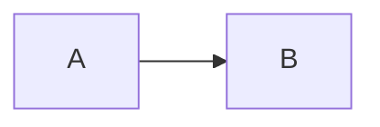
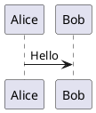

# 题库 JSON 统一格式

题库根节点必须是数组。推荐单题框架：

```json
{
  "id": "q-001",
  "number": 1,
  "type": "single",
  "content": "题干，支持纯文本或 Markdown",
  "format": "markdown",
  "options": { "A": "选项 A", "B": "选项 B" },
  "answer": "A",
  "explanation": "答案解析",
  "wrongDescription": "错因、易错点或复习提示"
}
```

完整示例见 `examples/question-bank.example.json`。机器可读约束见 `schemas/question-bank.schema.json`，LLM 转换结果应先通过该 Schema，再交给应用加载器规范化。

## 题型 type

- `single`：单选题
- `multiple`：多选题
- `true-false`：判断题
- `fill`：填空题
- `short-answer`：简答题
- `program-analysis`：程序分析题
- `code`：编程题
- `compound`：复合题

旧题库中的中文题型和 `SQL综合题` 仍兼容；新题库应使用以上稳定标识。

## 字段约定

- `id` 可选；`number` 可省略，省略时按数组顺序生成。
- `content` 是统一题干字段；旧字段 `question` 仍兼容。
- `format` 为 `text` 或 `markdown`，默认 `text`。
- `answerFormat`、`scenarioFormat`、`explanationFormat` 可覆盖对应内容格式，未指定时继承 `format`。
- `options` 是选项键值对象；多选答案可写成 `["A", "C"]` 或 `"AC"`。
- `answerDetail.accepts` 可列出多个可接受答案。
- `wrongDescription` 可填写错因、易错点或复习提示，仅在错题模式中重点展示；导出错题 JSON 时会保留。
- `images` contains image URL arrays. During DOCX conversion, embedded images are extracted into `images/<bank>/`; the prompt uses `<source_image id="..."/>` and the manifest to associate them with questions. Filenames are opaque numeric identifiers such as `img-001.png`; do not infer meaning from them or use local absolute paths/data URLs.
- 题干、场景、子题、答案或解析中出现的程序代码必须使用 Markdown fenced code block（例如 ` ```python `），并将对应格式设置为 `markdown`。
- `compound` 使用 `scenario` 与 `subQuestions`；子题同样优先使用 `content`。
- 同一题库的 `number` 不可重复，未知题型或结构错误会在加载时被拒绝。

## Markdown 图表

Mermaid：

````markdown

````

PlantUML（也接受 `puml`）：

````markdown

````

Mermaid 在浏览器本地渲染。PlantUML 默认把图表源码发送到 `diagram-renderer.json` 指定的远程服务器并返回 SVG；敏感内容应改用可信的自建 PlantUML Server，或将 `plantUml.enabled` 设置为 `false`。
